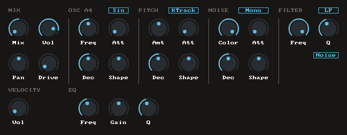

# JSDrumpad

JSFX drumpad synth inspired by vsts like Microtonic and DSK Synthdrums.

Features:
* 1x OSC (Sine, Triangle, Saw, or Square wave)
* 1x Noise generator (Stereo or mono)
* 3x Envelopes (osc, pitch and noise)
* 2x Filter (Noise color/lp, LowPass, BandPass and HighPass)
* 1x Distortion (Tube)
* 1x Band EQ

Available on ReaPack